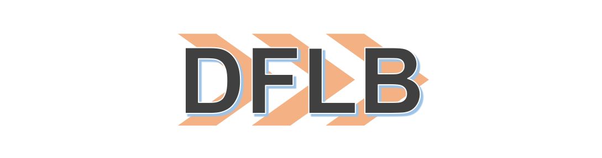

# DLFB(a Deep Learning Framework for Beginners)
DLFB 是一个面向深度学习初学者的轻量级/可扩展的深度学习框架，旨在为深度学习初学者提供一个可以用来学习/实操的框架。整体框架包括了从底层算子加速(avx/sse/cuda)，到深度学习整体计算图的构建/运行/自动求导，到可扩展的多机分布式优化。目前整体框架在快速迭代中，欢迎关注和贡献代码！
# Pros
目前使用 cpp 实现的深度学习框架，包括 [tiny-dnn](https://github.com/tiny-dnn/tiny-dnn)，相比之下，DLFB 有如下特点：
1. 易于学习理解。整体 api 设计仿照 pytorch，学习成本低；无第三方依赖，配合相关例程，代码可读性高；
2. 涵盖范围广泛。目前支持常用的 conv/fc/dropout/maxpooling 等算子，支持 SGD 优化算法；具体实现上，使用了 avx/sse/cuda 进行加速，并支持多机 allreduce 优化，目前正在快速迭代中，未来会支持更多算子和优化算法；

# 如何上手
使用 DLFB 来实现 mnist 数字分类
## BUILD
```
git clone https://github.com/shijieliu/DLFB.git
cd DLFB
mkdir build && cd build && cmake .. && make
```
## 准备数据
`minist` 相关数据介绍见[链接](http://yann.lecun.com/exdb/mnist/)，可以在 `data` 目录下运行脚本进行下载
``` shell
./mnist.sh
```
## 运行一个例子
见 example/mnist.cpp，在编译后 `build` 文件夹下的 `mnist` 可执行文件
``` cpp
// 构建网络
l::DataNode *image = dl::CreateNode({batchsize, 1, height, width});
dl::DataNode *label = dl::CreateNode({batchsize});
dl::DataNode *x1    = dl::nn::Conv2D(1, 6, 5)(image);
inner_nodes->insert(std::make_pair("x1", x1));
dl::DataNode *x2 = dl::nn::Maxpool2d(2, 2, 0)(x1);
inner_nodes->insert(std::make_pair("x2", x2));
dl::DataNode *x3 = dl::nn::Conv2D(6, 16, 5)(x2);
dl::DataNode *x4 = dl::nn::Maxpool2d(2, 2, 0)(x3);
dl::DataNode *x5 = dl::nn::Conv2D(16, 120, 2)(x4);
inner_nodes->insert(std::make_pair("x5", x5));
dl::DataNode *x6 = dl::nn::Maxpool2d(2, 2, 0)(x5);
inner_nodes->insert(std::make_pair("x6", x6));
dl::DataNode *reshape_x6 = dl::nn::Reshape({batchsize, 120})(x6);
inner_nodes->insert(std::make_pair("reshape x6", reshape_x6));
dl::DataNode *x7 = dl::nn::Linear(120, 84, false)(reshape_x6);
dl::DataNode *x8 = dl::nn::ReLU()(x7);
dl::DataNode *x9 = dl::nn::Linear(84, 10, false)(x8);
inner_nodes->insert({std::make_pair("x9", x9)});
dl::DataNode *logits = dl::nn::Softmax()(x9);
inner_nodes->insert({std::make_pair("logits", logits)});

// 计算 loss
dl::DataNode *loss = dl::nn::CrossEntropy()(logits, label);
inner_nodes->insert({std::make_pair("loss", loss)}); // 观察中间节点输出
dl::DataNode *loss_mean = dl::CreateNode<dl::ReduceMeanImpl>({loss});
inner_nodes->insert({std::make_pair("loss_mean", loss_mean)});

// 编译网络
auto loss_func = dl::Compile({image, label}, {loss});
loss_func.cuda(); // 选择 cuda 加速
std::unique_ptr<dl::Optimizer> optimizer(new dl::SGD(
    dl::Graph::GetInstance().params(), lr, momentum, weight_decay));

// 开始训练
vector<dl::Tensor> batch_imgs;
vector<dl::Tensor> batch_labels;
for (int epoch = 0; epoch < n_epoch; ++epoch) {
    dl::Shuffle(&train_data, &train_label);
    batch_imgs.clear();
    batch_labels.clear();
    dl::Split(train_data, train_label, batchsize, &batch_imgs,
                &batch_labels);

    LOG_INFO("start epoch:%d", epoch);
    for (int n_step = 0; n_step < batch_imgs.size(); ++n_step) {
        optimizer->zeroGrad();
        dl::Time("forward", [&]() {
            loss_func.forward({{image, batch_imgs[n_step]},
                                {label, batch_labels[n_step]}});
        });

        float loss_value = loss->tensor()->data()[0];
        LOG_INFO("\n\tepoch:%d\n\tstep:%d\n\tloss:%f", epoch, n_step,
                    loss_value);
        dl::Time("backward", [&]() {
            loss_func.backward({{loss, *(loss->tensor())}});
        });

        optimizer->step();
        for (auto inner_node_pack : inner_nodes) {
            dl::DisplayTensor(inner_node_pack.second->tensor(),
                                inner_node_pack.first + " tensor ");
            dl::DisplayTensor(inner_node_pack.second->grad(),
                                inner_node_pack.first + " grad ");
        }
    }
}
```

# TODO
1. 相关算子速度 benchmark
2. 多机优化
3. 后续支持更多算子(如 batchnorm)
